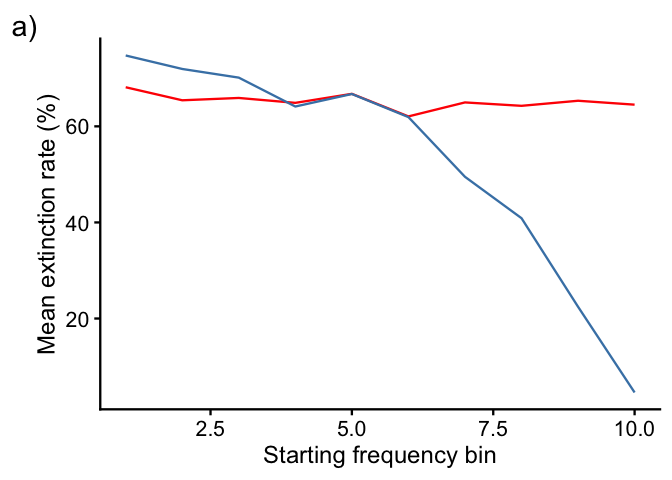
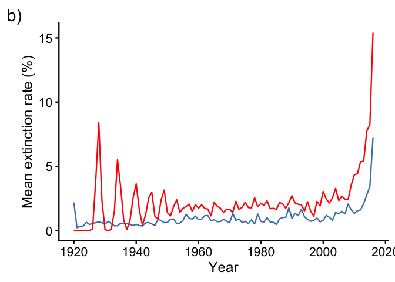
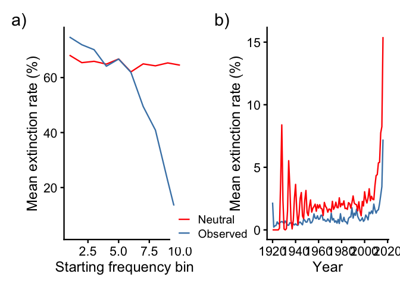

gj_code
================

# Evolution Mini Project

## File setup

``` r
# clearing world environment
rm(list = ls())

# R package loading
library(tidyverse)
```

    ## ── Attaching core tidyverse packages ──────────────────────── tidyverse 2.0.0 ──
    ## ✔ dplyr     1.1.4     ✔ readr     2.1.5
    ## ✔ forcats   1.0.0     ✔ stringr   1.6.0
    ## ✔ ggplot2   4.0.1     ✔ tibble    3.3.0
    ## ✔ lubridate 1.9.4     ✔ tidyr     1.3.1
    ## ✔ purrr     1.1.0     
    ## ── Conflicts ────────────────────────────────────────── tidyverse_conflicts() ──
    ## ✖ dplyr::filter() masks stats::filter()
    ## ✖ dplyr::lag()    masks stats::lag()
    ## ℹ Use the conflicted package (<http://conflicted.r-lib.org/>) to force all conflicts to become errors

``` r
# importing required rds file
names <- readRDS("Names_1920to2015.rds")
```

## Data Wrangling

``` r
# establishing number of individuals per year
yearly <- names %>%
  select(year, N_year_total) %>% unique()

# establishing number of names present in 1920 (first year)
names_1920 <- names %>%
  filter(year == "1920")
nrow(names_1920) # 4990 names in 1920
```

    ## [1] 4990

``` r
# establishing number of names present in 2017 (final year)
names_2017 <- names %>%
  filter(year == "2017") %>% 
  filter(N > 0)
nrow(names_2017) # 2360 names in 2017
```

    ## [1] 2360

``` r
# 30 most common names
names_30common <- names %>%
  group_by(name) %>%
  summarize(N=sum(N)) %>%
  arrange(desc(N)) %>%
  ungroup() %>%
  slice(1:30)
keepnames <- names_30common$name
```

# Creating vectors

These will go into the functions.

``` r
# creating a vector of total names / year
N_years <- setNames(yearly$N_year_total, yearly$year)

# creating a vector of years
years <- sort(unique(yearly$year))

# creating a vector of starting frequencies
f0 <- names_1920$freq
```

# Functions

This step is to set up functions that will run the neutral model
simulations. This is independent to the actual number of simulations
run, allowing for flexibility in the model.

## Summary stat calculation function (extinction rate)

``` r
stats_summary <- function(df) {
  
  # names present in final year of simulation
  sim_final_names <- df %>%
    filter(year == max(year), N > 0) %>%
    pull(name)
  
  # starting frequencies from simulation year 1
  sim_start <- df %>%
    filter(year == min(year)) %>%
    select(name, N)
  
  # relative frequency
  f0_sim <- sim_start$N / sum(sim_start$N)
  
  # EXPECTED EXTINCTION: present in 1920 but absent in final year
  p_extinct <- as.numeric(!(sim_start$name %in% sim_final_names))
  
  # LASTYEAR: last year a name was seen
  lastyear <- df %>%
    group_by(name) %>%
    summarise(lastyear = max(year[N > 0]), .groups = "drop") %>%
    arrange(name) %>%
    pull(lastyear)
  
  return(list(
    f0 = f0_sim,
    name = sim_start$name,
    p_extinct = p_extinct,
    lastyear = lastyear))
}
```

## Run simulation function

``` r
# creating a function to run 1000 simulations
sim_run <- function() {
  
  # Creating first population in 1920
  pop <- rep(names$name[names$year == years[1]],
             names$N[names$year == years[1]])
  
  simulation_list <- list()
  simulation_list[[1]] <- pop
  
  # Simulate populations from 1920 to 2017
  for(i in 2:length(years)) {
    pop <- sample(pop, size = N_years[as.character(years[i])],
                  replace = TRUE)
    simulation_list[[i]] <- pop}
  
  # Combining outputs into a vector
  counts_list <- lapply(simulation_list, table)
  
  # Converting to data frame
  sim_df <- purrr::map2_dfr(counts_list, years,
    ~ tibble(year = .y, name = names(.x), N = as.numeric(.x)))
  
  sim_df}
```

# Running the simulation

Run the specified number of simulations and collect observed
extinctions. By changing `n_sims`, you can modify the simulations to
your desired number of runs. For this notebook simulation, N = 10. Full
model (N = 1000 simulations) will be included as an RDS for loading
later.

``` r
n_sims <- 10
sim_stats <- purrr::map(
  seq_len(n_sims),
  ~ stats_summary(sim_run()),
  .progress = TRUE
)
```

    ## ■■■■ 10% | ETA: 1m ■■■■■■■ 20% | ETA: 1m ■■■■■■■■■■ 30% | ETA: 1m ■■■■■■■■■■■■■
    ## 40% | ETA: 1m ■■■■■■■■■■■■■■■■ 50% | ETA: 41s ■■■■■■■■■■■■■■■■■■■ 60% | ETA:
    ## 33s ■■■■■■■■■■■■■■■■■■■■■■ 70% | ETA: 25s ■■■■■■■■■■■■■■■■■■■■■■■■■ 80% | ETA:
    ## 17s ■■■■■■■■■■■■■■■■■■■■■■■■■■■■ 90% | ETA: 8s

``` r
# confirming simulations ran as expected
length(sim_stats) # 10
```

    ## [1] 10

``` r
# extracting average expected & observed extinction across sampling simulations
extinct_expected   <- rowMeans(sapply(sim_stats, `[[`, "p_extinct"))
lastyear   <- rowMeans(sapply(sim_stats, `[[`, "lastyear"))
extinct_observed <- as.numeric(!(names_1920$name %in% names_2017$name))

# checking lengths
length(extinct_expected) # 4990
```

    ## [1] 4990

``` r
length(lastyear) # 4990
```

    ## [1] 4990

``` r
length(extinct_observed) # 4990
```

    ## [1] 4990

# Simulation analysis

## Extracting extinction rate (observed vs. expected extinctions)

``` r
# overall comparison
cat("Mean observed extinction:", round(mean(extinct_observed), 3), "\n")
```

    ## Mean observed extinction: 0.527

``` r
cat("Mean expected extinction:", round(mean(extinct_expected), 3), "\n")
```

    ## Mean expected extinction: 0.653

``` r
extinction_results <- data.frame(
  name     = names_1920$name,
  f0       = f0,
  observed = extinct_observed,
  expected = extinct_expected,
  lastyear = lastyear)
```

## Combining extinction rates

``` r
# Combining extinction rates (observed and expected) across years)
extinction_over_time <- names %>%
  group_by(name) %>%
  summarise(endyear = max(year[N > 0]),  .groups = "drop") %>% # last year each name was present
  filter(endyear < max(years)) %>%
  group_by(endyear) %>%
  summarise(n_extinct = n(), .groups = "drop") %>%
  left_join(
    names %>% group_by(year) %>% summarise(n_present = sum(N > 0), .groups = "drop"),
    by = c("endyear" = "year")) %>%
  mutate(obs_rate = (n_extinct / n_present)*100) # remove final year (can't distinguish extinction from censoring)

expected_over_time <- extinction_results %>%
  mutate(lastyear = round(lastyear)) %>%
  filter(lastyear < max(years)) %>%
  group_by(lastyear) %>%
  summarise(n_extinct = n(), .groups = "drop") %>%
  arrange(lastyear) %>%
  mutate(n_present = 4990 - cumsum(lag(n_extinct, default = 0))) %>%
  mutate(exp_rate = (n_extinct / n_present) * 100)

extinction <- extinction_over_time %>%
  left_join(expected_over_time, by = c("endyear" = "lastyear")) %>%
  mutate(obs_rate = replace_na(obs_rate, 0),
         exp_rate = replace_na(exp_rate, 0))
```

## Statistical tests

#### Test 1: Overall test

Are overall extinction rates different from Wright-Fisher model
expectations?

``` r
# Binomial test comparing each name's observed vs. expected extinctions through 1920 - 2017
binom <- binom.test(
  x = round(sum(extinction_results$observed) * n_sims), # total extinctions across sims
  n = nrow(extinction_results) * n_sims, # total name-sim pairs
  p = mean(extinction_results$expected)) # WF expected rate
p_binom <- binom$p.value # p-value = 6.916919e-323 for the 1000 simulations

# Wilcoxon signed-rank test (non-parametric) comparing each year's observed vs. expected extinctions through 1920 - 2017
# Remove years where exp_rate is NA or zero
extinction_clean <- extinction %>%
  filter(!is.na(exp_rate) & !is.na(obs_rate) & exp_rate > 0)

wilcox.test(extinction_clean$obs_rate, extinction_clean$exp_rate, paired = TRUE)
```

    ## 
    ##  Wilcoxon signed rank test with continuity correction
    ## 
    ## data:  extinction_clean$obs_rate and extinction_clean$exp_rate
    ## V = 126, p-value = 5.678e-16
    ## alternative hypothesis: true location shift is not equal to 0

``` r
# p-value = 1.136e-15 for the 1000 simulations
```

#### Test 2: Logistic regression (GLMs)

Does observed extinction deviate from expected, controlling for f0?

``` r
extinction_results$residual <- extinction_results$observed - extinction_results$expected

# GLM (binomial) on each name's observed vs. expected extinctions through 1920 - 2017
glm_fit <- glm(observed ~ expected + log(f0), 
               data = extinction_results, 
               family = binomial())
summary_glmfit <- summary(glm_fit)
p_reg <- summary_glmfit$coefficients[3,4] 
p_reg # p-value = 7.495717e-166 for the 1000 simulations
```

    ## [1] 8.246018e-166

``` r
# GLM (Gaussian) on each year's observed vs. expected extinctions through 1920 - 2017
glm_year <- glm(obs_rate ~ exp_rate + endyear, 
               data = extinction, 
               family = gaussian())
summary_glmyear <- summary(glm_year)
p_year <- summary_glmyear$coefficients[3,4]
p_year # p-value = 0.002362611 for the 1000 simulations. for 10 simulations, may return as non-significant.
```

    ## [1] 0.09581547

#### Test 3: Correlation

Do names that the Wright-Fisher neutral model predict will go extinct
actually go extinct?

``` r
# Test on each name
cor.test(extinction_results$observed, extinction_results$expected, method = "spearman") 
```

    ## Warning in cor.test.default(extinction_results$observed,
    ## extinction_results$expected, : Cannot compute exact p-value with ties

    ## 
    ##  Spearman's rank correlation rho
    ## 
    ## data:  extinction_results$observed and extinction_results$expected
    ## S = 2.0479e+10, p-value = 0.4346
    ## alternative hypothesis: true rho is not equal to 0
    ## sample estimates:
    ##        rho 
    ## 0.01106349

``` r
# # p-value = 0.434

# Test on each year
cor.test(extinction$obs_rate, extinction$exp_rate, method = "spearman") 
```

    ## 
    ##  Spearman's rank correlation rho
    ## 
    ## data:  extinction$obs_rate and extinction$exp_rate
    ## S = 104202, p-value = 0.001762
    ## alternative hypothesis: true rho is not equal to 0
    ## sample estimates:
    ##       rho 
    ## 0.3148932

``` r
# p-value = 3.845e-05
```

# Saving results

``` r
# saving script for future usage
results <- list(
  sim_stats  = sim_stats,
  extinction_results = extinction_results,
  extinction = extinction,
  n_sims      = n_sims)

saveRDS(results, "namesim_results10.rds")
```

# Reading results

``` r
sim1000 <- readRDS("namesim_results1000.rds")
extinction_results <- sim1000$extinction_results
extinction <- sim1000$extinction
n_sims <- sim1000$n_sims
```

# Plotting results

#### Plot 1: By starting frequency bins (Extinction Rate by Starting Frequency)

<!-- -->

#### Plot 2: Rate of extinction per year (observed vs. expected)

<!-- -->

#### Merging the plots into one panel

``` r
library(patchwork)
library(cowplot)
```

    ## 
    ## Attaching package: 'cowplot'

    ## The following object is masked from 'package:patchwork':
    ## 
    ##     align_plots

    ## The following object is masked from 'package:lubridate':
    ## 
    ##     stamp

``` r
# remove legends from both plots
plot1_noleg <- plot1 + theme(legend.position = "none")
plot2_noleg <- plot2 + theme(legend.position = "none")

# extract legend from plot1
legend <- cowplot::get_legend(plot1)

# combine with legend in middle
plot1_noleg + legend + plot2_noleg +
  plot_layout(widths = c(2, 0.1, 2))
```

<!-- -->
